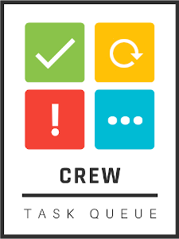

# Crew-Go



Crew is a task management system. It is designed to be used as a library in your own Go project or as a standalone service. Crew workers are simply webooks so they can be written in any language.

Crew supports the following features:
- Complex parent / child task structure (directed acyclic graph)
- Pause and resume groups of tasks
- Continuations (tasks can create child tasks)
- Delayed, scheduled tasks
- Can manage rate limit errors by automatically pausing all tasks in same workgroup
- Automatically merges output of duplicate tasks
- Workers can be written in any language
- Can embed in an Echo](https://echo.labstack.com/) app

## Running from source

Compile the UI

```
cd crew
cd crew-go-ui
yarn
yarn build
```

Run the service

```
go get
cp main.go.example main.go
go run main.go
```

To run the UI in development mode (built with [quasar](https://quasar.dev/)))

```
cd crew
cd crew-go-ui
yarn
yarn dev
```

To run tests

```
cd crew
go test
```

OR

```
go test -cover
```

## Running demo tasks

Crew includes three demo workers (worker-a, worker-b, and worker-c) that you can use to see how everything works.

[](https://www.loom.com/share/853e0cf55e514df99a8dc6eeddcc3c00)

## Persistence

Crew can store tasks in memory or Redis.  No persistence is available for in-memory storage.

## Customizing

You can use the following environment variables to customize the service:
CREW_AUTH_USERNAME: Username for login (defaults to admin)
CREW_AUTH_PASSWORD: Password for login (defaults to crew)
CREW_AUTH_TOKEN: Token for api access (only use this if not using the UI to login)
CREW_WORKER_BASE_URL: Base url for workers (defaults to http://localhost:8080).  Example : https://us-central1-my-project.cloudfunctions.net/
CREW_WORKER_AUTHORIZATION_HEADER: Auth header that crew will send with requests to workers.

Note, when embedding crew in your own Go project you can supply a login function and an authentication middleware to override the default authentication behavior. See main.go for examples.

### About Tree Structure

The tasks in Crew can be composed to form a tree structure.  Each task can have zero or many parents. Tasks can also have zero or many children.  The parentIds field on Tasks is used to form these relationships.  *A task will never be assigned to a worker until all of it's parent tasks have completed successfully.*

Task Groups are used to break large tasks down into many small tasks.  Every task belongs to a group.

### About Task Group Reset / Seed Jobs

Task Groups can be re-set which will allow them to be re-executed.  This should only be used for developing / debugging workers. 

Tasks flagged with isSeed=True, are the only tasks that are retained when a task group is reset.  If a task group doesn't have any seed tasks, all tasks will be retained when the task group is reset.

### About Continuations

A continuation occurs when execution of a task results in additional tasks.  Continuation tasks are always children of the task that created them. See the /demo/worker-c route in rest_api.go for an example of how a worker should return child tasks.

### About Duplication Merge

Crew can automatically complete tasks that are identical.  The primary use case for this feature is when a large volume of nightly tasks fails to complete before the next night's run.  Instead of creating an even larger bottleneck, duplicate tasks can be merged instead of repeated.

The "key" field is used for duplication merge.  Whenever Crew assigns a task it will find any other tasks that have the same key in the same task group. Whenever Crew is completing a task it will look for any other tasks that have the same key in the same task group.  The matching tasks will receive the same output or error.

### About Workers

Workers are simply webhooks that are called by Crew.  Workers are responsible for executing the task and returning the a result.  Workers are called with a POST request that contains the task in the body. Workers should respond with a 200 status code if the task was successfully completed.  Workers should respond with an http error code if the task failed. Please see the /demo/worker-* routes in rest_api.go for examples.

Workers should follow these rules:
* Workers take json input and return json output. See below for schemas.
* Workers return a non-200 error code if they fail to complete the task.
* Workers should be designed so that they cause no harm if the same job is repeated.
* Workers should be designed so that they always complete in under 60 seconds, workers that cannot complete in this amount of time should break the work into smaller continuations.

Worker post body schema (json)

```
{
    "input": {"any": "json"},
    "parents": [{
        "taskId": "Id of parent task",
        "worker": "Name of parent worker",
        "input":  {"any": "json given to parent as input"},
        "output": ["any output from parent"],
    }],
    "worker":  "Name of worker",
    "taskId":  "Id of worker",
}
```

Worker response schema (json)

```
{
    "output": {"any": "json"},
    "children": [{
        "id": "Id of child task",
        "parentIds": "Id of parent task (must be another child in this output array)",
        "worker": "Name of child worker",
        "input":  {"any": "json given to child as input"},
    }],
	"workgroupDelayInSeconds": 0,
    "childrenDelayInSeconds": 0,
    "error": "Any error message or json (note that worker response must also be non-200)",
}
```

If workgroupDelayInSeconds is included in response, all tasks in the same workgroup will be paused for the specified amount of time.  This is useful for rate limiting errors.
If childrenDelayInSeconds is included in response, all children will be delayed for the specified amount of time.

### About Workgroups

Crew is designed to help manage rate limit errors via workgroups.  When a rate limit error is encountered all the tasks within a workgroup can be delayed by a specific amount of time by including "workgroupDelayInSeconds" in the response.  Since workgroups will often be organized around a specific API key it is recommended that you use an md5 hash of the API key instead of the key itself when creating workgroup names.

### About Throttling

If you need to restrict how many tasks are concurrently executing for a specific worker you can implement a throttler.  See main.go.example for a simple example.  Below is an example that restricts the total numnber of tasks on a per-worker basis.

Throttler is a simple interface that requires two channels, Push and Pop. Whenever crew is ready to execute a task it sends a message on Push that contains a Resp channel. When your throttler is ready to allow the task to execute, send a true on Resp. As tasks complete (or error) crew will send a message to Pop to notify your throttler that the task is no longer pending.


```go
// Max X concurrent task per worker
defaultMaxConcurrentTasks := 1
maxConcurrentTasksByWorker := map[string]int{
	"worker-a": 3,
	"worker-b": 2,
	"worker-c": 1,
}
go func() {
	executingTasks := make(map[string][]crew.ThrottlePushQuery)
	pendingTasks := make(map[string][]crew.ThrottlePushQuery)
	for {
		select {
		case pushQuery := <-throttlePush:
			// Get count of tasks currently executing for this worker
			executingTasksCount := len(executingTasks[pushQuery.Worker])

			maxConcurrentTasks := defaultMaxConcurrentTasks
			if val, exists := maxConcurrentTasksByWorker[pushQuery.Worker]; exists {
				maxConcurrentTasks = val
			}

			if executingTasksCount < maxConcurrentTasks {
				// Push this query on the executing queue
				queue, exists := executingTasks[pushQuery.Worker]
				if !exists {
					// Create queue if it doesn't exist
					queue = make([]crew.ThrottlePushQuery, 0)
				}
				queue = append(queue, pushQuery)
				executingTasks[pushQuery.Worker] = queue

				// Send message to immediately run this
				pushQuery.Resp <- true
			} else {
				// Push this query on the pending queue
				queue, exists := pendingTasks[pushQuery.Worker]
				if !exists {
					// Create queue if it doesn't exist
					queue = make([]crew.ThrottlePushQuery, 0)
				}
				queue = append(queue, pushQuery)
				pendingTasks[pushQuery.Worker] = queue
			}

		case popQuery := <-throttlePop:
			// Remove this task from the executing queue
			queue := make([]crew.ThrottlePushQuery, 0)
			for _, task := range executingTasks[popQuery.Worker] {
				if task.TaskId != popQuery.TaskId {
					queue = append(queue, task)
				}
			}

			// If there are pending tasks, move the first one to the executing queue
			pendingQueue, pendingExists := pendingTasks[popQuery.Worker]
			if pendingExists && len(pendingQueue) > 0 {
				// Remove from pending queue
				pendingQuery := pendingQueue[0]
				pendingQueue = pendingQueue[1:]
				pendingTasks[popQuery.Worker] = pendingQueue

				// Add to executing queue
				queue = append(queue, pendingQuery)

				// Send message to execute task
				pendingQuery.Resp <- true
			}

			// Store updates to executing
			executingTasks[popQuery.Worker] = queue
		}
	}
}()

taskGroupsOperator, bootstrapError := storage.Bootstrap(true, client, &throttler)
```

### About Persistence

Crew provides two storage mechanisms out of the box: in-memory or redis.  You can also implement the TaskStorage interface to use your own storage mechanism. See main.go.example for examples of configuring storage.

### Embedding in an Echo Server

Crew can be added to any application that uses [Echo](https://echo.labstack.com/).

First, get crew:

```
go get github.com/aaronblondeau/crew-go/crew
```

Then set some env vars:

```
CREW_WORKER_BASE_URL=http://localhost:3000/crew/worker/
CREW_WORKER_AUTHORIZATION_HEADER=doit
```

Use this code to add crew (work is in progress to boil this down to a more friendly interface).

```go
e := echo.New()

// ...

// Use redis for crew persistence
crewRedisAddress := os.Getenv("REDIS_ADDRESS")
if crewRedisAddress == "" {
	crewRedisAddress = "localhost:6379"
}
crewRedisPassword := os.Getenv("REDIS_PASSWORD")
storage := crew.NewRedisTaskStorage(crewRedisAddress, crewRedisPassword, 1)
defer storage.Client.Close()

// Use http post workers
crewClient := crew.NewHttpPostClient()

// No throttling of workers in this demo
throttlePush := make(chan crew.ThrottlePushQuery, 8)
throttlePop := make(chan crew.ThrottlePopQuery, 8)
crewThrottler := &crew.Throttler{
	Push: throttlePush,
	Pop:  throttlePop,
}
go func() {
	for {
		select {
		case pushQuery := <-throttlePush:
			// Default behavior = immediate response => no throttling
			fmt.Println("~~ Would throttle", pushQuery.Worker, pushQuery.TaskId)
			pushQuery.Resp <- true
		case popQuery := <-throttlePop:
			fmt.Println("~~ Would unthrottle", popQuery.Worker, popQuery.TaskId)
		}
	}
}()

// Create the task controller (call to startup is further down)
crewController := crew.NewTaskController(storage, crewClient, crewThrottler)

// Validates each crew api call's Authorization header.  TODO - replace this with something that secures the crew routes.
crewAuthMiddleware := func(next echo.HandlerFunc) echo.HandlerFunc {
	return func(c echo.Context) error {
		// For systems requiring no auth, just return next(c)
		return next(c)
	}
}

// Create the crew rest api server (via echo) and mount at /crew
inShutdown := false
watchers := make(map[string]crew.TaskGroupWatcher, 0)
crew.BuildRestApi(e, "/crew", crewController, crewAuthMiddleware, nil, &inShutdown, watchers)

// Add worker routes to crewEcho
// TODO...
// e.POST("/crew/worker/worker-a", func(c echo.Context) error {
//   // TODO, check that CREW_WORKER_AUTHORIZATION_HEADER was sent before doing the work to make sure crew called us and not somebody else.
// })

// Start the crew controller
startupError := crewController.Startup()
if startupError != nil {
	panic(startupError)
}

```

#### Dev Todos

TODO : When a task with children is deleted, how do we prevent orphans?

TODO : When a task with children is reset, should all ancestors also be reset?

#### Deploy notes

cd crew/crew-go-ui
yarn build
cd ../..

go mod tidy
go test ./crew
git add .
git commit -m "todo"
git push origin main
git tag v1.0.todo
git push origin v1.0.todo
